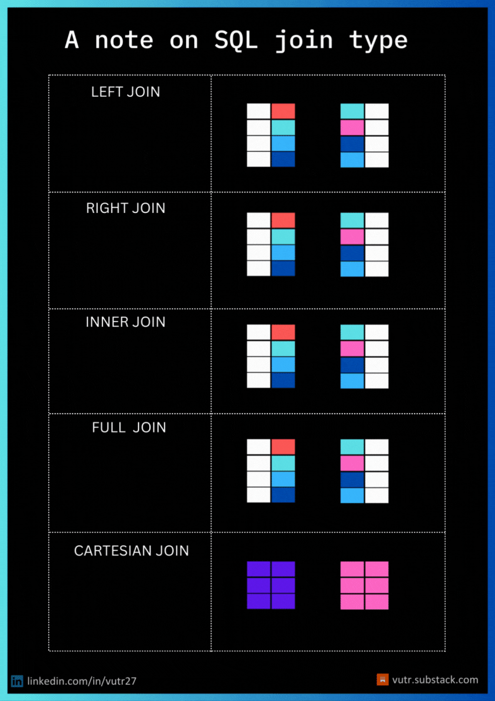

# ✈️ Tables multiples — Gérez l'agence de voyage Globe-Trotter

## 1. Introduction — Pourquoi plusieurs tables ?

Jusqu'ici, nous avons travaillé avec une seule table à la fois. En pratique, les bases de données contiennent **plusieurs tables** reliées entre elles. C'est ce qui rend les bases **relationnelles**.

### Le problème : tout dans une seule table

Imaginons que nous gérons **Globe-Trotter**, une agence de voyage étudiante. Si on met tout dans une seule table, voilà ce que ça donne :

| id_resa | prenom | nom | age | email | ville_dest | pays | continent | prix_vol | type_hebergement | prix_total |
|---|---|---|---|---|---|---|---|---|---|---|
| 1 | Hugo | Martin | 20 | hugo@mail.com | Barcelone | Espagne | Europe | 89 | Auberge | 320 |
| 2 | **Hugo** | **Martin** | **20** | **hugo@mail.com** | Marrakech | Maroc | Afrique | 130 | Riad | 580 |
| 5 | Lucas | Bernard | 20 | lucas@mail.com | **Barcelone** | **Espagne** | **Europe** | **89** | Auberge | 340 |

Problème visible : **Hugo** est répété 2 fois (lignes 1 et 2). **Barcelone** est répétée 2 fois (lignes 1 et 5). Avec des milliers de réservations, c'est ingérable.

### La solution : séparer en 3 tables

**Table `voyageurs`** — chaque personne n'apparaît **qu'une seule fois** :

| id_voyageur | prenom | nom | age | email |
|---|---|---|---|---|
| 1 | Hugo | Martin | 20 | hugo@mail.com |
| 3 | Lucas | Bernard | 20 | lucas@mail.com |

**Table `destinations`** — chaque destination n'apparaît **qu'une seule fois** :

| id_destination | ville | pays | continent | prix_vol |
|---|---|---|---|---|
| 1 | Barcelone | Espagne | Europe | 89 |
| 6 | Marrakech | Maroc | Afrique | 130 |

**Table `reservations`** — fait le **lien** entre les deux grâce à des numéros de référence :

| id_reservation | id_voyageur | id_destination | date_depart | type_hebergement | prix_total |
|---|---|---|---|---|---|
| 1 | **1** | **1** | 2026-07-01 | Auberge | 320 |
| 2 | **1** | **6** | 2026-08-10 | Riad | 580 |
| 5 | **3** | **1** | 2026-07-01 | Auberge | 340 |

Les colonnes `id_voyageur` et `id_destination` dans `reservations` sont des **références** vers les autres tables. On les appelle des **clés étrangères** — on les explique en détail dans la section suivante.

### À vous de jouer ! 🤠

1. Importez le fichier `voyage.sql` dans votre éditeur.

2. Examinez les 3 tables principales :

```sql
SELECT * FROM voyageurs;
SELECT * FROM destinations;
SELECT * FROM reservations;
```

Combien de lignes contient chaque table ?

<details>
<summary>Vérification ✅</summary>
<p><code>voyageurs</code> : 10 lignes | <code>destinations</code> : 10 lignes | <code>reservations</code> : 22 lignes.</p>
</details>

---

## 2. Combiner les tables manuellement

En regardant la table `reservations` seule, on ne voit que des numéros :

| id_reservation | id_voyageur | id_destination | date_depart | prix_total |
|---|---|---|---|---|
| 3 | **2** | **3** | 2026-07-15 | 410 |
| 7 | **4** | **8** | 2026-08-01 | 1890 |

Que signifie la réservation n°3 ? Pour le savoir, il faut **consulter les autres tables** :

**Étape 1** — On prend `id_voyageur = 2` et on cherche dans `voyageurs` :

| id_voyageur | prenom | nom |
|---|---|---|
| **2** | **Léa** | **Dupont** |

**Étape 2** — On prend `id_destination = 3` et on cherche dans `destinations` :

| id_destination | ville | pays |
|---|---|---|
| **3** | **Rome** | **Italie** |

**Résultat** : la réservation n°3 = **Léa Dupont** part à **Rome** le 15 juillet pour **410 €**.

Ce processus de correspondance s'appelle une **jointure**. Le faire à la main est possible, mais fastidieux.

### À vous de jouer ! 🤠

En consultant les tables **manuellement** (sans requête SQL) :

1. Quelle **ville** correspond à la réservation n°9 ?

<details>
<summary>Indice 🔑</summary>
<p>Cherchez d'abord l'<code>id_destination</code> de la réservation n°9 dans la table <code>reservations</code>.</p>
</details>

<details>
<summary>Vérification ✅</summary>
<p>Réservation n°9 → <code>id_destination = 2</code> → <strong>Lisbonne</strong>, Portugal.</p>
</details>

2. Quel est le **prénom** du voyageur de la réservation n°7 ?

<details>
<summary>Vérification ✅</summary>
<p>Réservation n°7 → <code>id_voyageur = 4</code> → <strong>Emma</strong>.</p>
</details>

3. Décrivez en une phrase la réservation n°13 (qui, où, quand, combien).

<details>
<summary>Vérification ✅</summary>
<p><strong>Adam</strong> (id 7) part à <strong>Marrakech</strong> (id 6) le 20 juillet pour <strong>610 €</strong>.</p>
</details>

---

## 3. Clé primaire et clé étrangère

Avant d'automatiser les jointures avec SQL, clarifions **comment les tables sont reliées**. Deux concepts sont essentiels.

### Clé primaire

C'est la colonne qui identifie **de manière unique** chaque ligne d'une table :

| Table | Clé primaire | Exemple |
|---|---|---|
| `voyageurs` | `id_voyageur` | 1, 2, 3… (unique, jamais NULL) |
| `destinations` | `id_destination` | 1, 2, 3… (unique, jamais NULL) |
| `reservations` | `id_reservation` | 1, 2, 3… (unique, jamais NULL) |

**Règles** : pas de `NULL`, pas de doublons, une seule clé primaire par table.

### Clé étrangère

Quand la clé primaire d'une table apparaît **dans une autre table**, elle devient une **clé étrangère**. Elle sert de **lien** entre les tables.

Regardons la table `reservations` :

| id_reservation | id_voyageur | id_destination | prix_total |
|---|---|---|---|
| 1 | **1** | **1** | 320 |

- `id_reservation` = clé primaire de `reservations`
- `id_voyageur` = clé étrangère → pointe vers la clé primaire de `voyageurs`
- `id_destination` = clé étrangère → pointe vers la clé primaire de `destinations`

C'est grâce à ces clés que le `JOIN` saura **comment relier** les tables :

```sql
-- Clé étrangère → clé primaire
ON reservations.id_voyageur = voyageurs.id_voyageur
```

> 💡 **Règle d'or** : les jointures relient presque toujours une **clé étrangère** à une **clé primaire**.

### Un garde-fou : l'intégrité référentielle

Dans une base bien conçue, une contrainte `FOREIGN KEY` **interdit d'insérer une clé étrangère qui ne correspond à aucune clé primaire**. Par exemple, il serait impossible de créer une réservation pour un voyageur inexistant. Dans notre base d'exercice, cette contrainte n'est pas activée — ce qui nous permettra d'observer, à la section suivante, ce qui arrive quand une correspondance est absente.

### À vous de jouer ! 🤠

L'agence a aussi des tables pour ses bureaux et ses agents :

**`bureaux`** (4 lignes) — clé primaire : `id`

| id | nom_bureau | ville |
|---|---|---|
| 1 | Bureau Europe | Lyon |
| 2 | Bureau Asie | Lyon |
| 3 | Bureau Amérique | Paris |
| 4 | Bureau Afrique | Marseille |

**`agents`** (9 lignes) — clé primaire : `id`, clé étrangère : `id_bureau`

| id | prenom | specialite | id_bureau |
|---|---|---|---|
| 1 | Alice | Vols low-cost | 1 |
| 3 | Yuki | Séjours culturels | 2 |
| 9 | Nina | Interrail | **NULL** |

1. Examinez les deux tables complètes avec `SELECT *`. Combien de bureaux ? Combien d'agents ?

<details>
<summary>Vérification ✅</summary>
<p><strong>4 bureaux</strong> et <strong>9 agents</strong>.</p>
</details>

2. Dans la table `agents`, quelle colonne est la **clé primaire** ? Quelle colonne est la **clé étrangère** ? Vers quelle table pointe-t-elle ?

<details>
<summary>Vérification ✅</summary>
<p><code>agents.id</code> est la <strong>clé primaire</strong> de <code>agents</code>. <code>agents.id_bureau</code> est la <strong>clé étrangère</strong> qui pointe vers <code>bureaux.id</code>.</p>
</details>

3. Nina a `id_bureau = NULL`. Qu'est-ce que cela signifie dans ce contexte ?

<details>
<summary>Vérification ✅</summary>
<p>Nina n'est rattachée à aucun bureau. Sa spécialité Interrail est transversale. Le <code>NULL</code> exprime l'absence de valeur — pas zéro, pas vide : <em>inconnu ou non applicable</em>.</p>
</details>

---

## Tour d'horizon des types de jointures




## 4. Combinaison de tables avec JOIN

Automatisons la jointure manuelle avec la commande `JOIN` :

```sql
SELECT *
FROM reservations
JOIN destinations
  ON reservations.id_destination = destinations.id_destination;
```

Voici ce que fait cette commande, pas à pas :

| Ce qu'on écrit | Ce que ça fait |
|---|---|
| `SELECT *` | Sélectionne toutes les colonnes **des deux tables** |
| `FROM reservations` | Part de la table `reservations` |
| `JOIN destinations` | Lui ajoute la table `destinations` |
| `ON reservations.id_destination = destinations.id_destination` | Relie chaque réservation à sa destination correspondante |

**Avant le JOIN** (table `reservations` seule) :

| id_reservation | id_voyageur | id_destination | prix_total |
|---|---|---|---|
| 1 | 1 | **1** | 320 |
| 2 | 1 | **6** | 580 |

**Après le JOIN** (réservations + destinations combinées) :

| id_reservation | id_voyageur | id_destination | prix_total | ville | pays | continent | prix_vol |
|---|---|---|---|---|---|---|---|
| 1 | 1 | 1 | 320 | **Barcelone** | **Espagne** | **Europe** | **89** |
| 2 | 1 | 6 | 580 | **Marrakech** | **Maroc** | **Afrique** | **130** |

Les colonnes de `destinations` sont venues **s'ajouter** à droite de chaque ligne de `reservations`, là où l'`id_destination` correspondait.

### La syntaxe `table.colonne`

Les deux tables ont une colonne nommée `id_destination`. Pour éviter l'ambiguïté, on écrit : `reservations.id_destination` et `destinations.id_destination`.

Cette syntaxe s'utilise partout : `SELECT`, `WHERE`, `ON`, `ORDER BY`…

On peut aussi sélectionner des **colonnes précises** au lieu de `*` :

```sql
SELECT reservations.id_reservation,
       destinations.ville,
       destinations.pays,
       reservations.prix_total
FROM reservations
JOIN destinations
  ON reservations.id_destination = destinations.id_destination;
```

### Les alias de table

Quand les noms de tables sont longs, on peut leur donner un **alias** (un surnom) avec `AS` ou simplement une lettre juste après le nom. Cela raccourcit considérablement les requêtes et c'est la convention la plus répandue dans le code SQL professionnel :

```sql
-- Sans alias (verbeux)
SELECT reservations.id_reservation,
       destinations.ville
FROM reservations
JOIN destinations
  ON reservations.id_destination = destinations.id_destination;

-- Avec alias (beaucoup plus lisible)
SELECT r.id_reservation,
       d.ville
FROM reservations AS r
JOIN destinations AS d
  ON r.id_destination = d.id_destination;
```

> 💡 L'alias est défini dans le `FROM` ou le `JOIN`, et peut ensuite être utilisé partout dans la requête — y compris dans le `SELECT` qui le précède à l'écrit. SQL lit le `FROM` en premier.

### À vous de jouer ! 🤠

1. Joignez `reservations` et `destinations` sur `id_destination`. Sélectionnez **toutes les colonnes**.

<details>
<summary>Rappel 🔑</summary>
<p><code>SELECT * FROM table1 JOIN table2 ON table1.colonne = table2.colonne;</code></p>
</details>

2. Modifiez la requête pour ne sélectionner que les colonnes `id_reservation`, `ville`, `pays` et `prix_total`. Utilisez des **alias** (`r` et `d`) pour raccourcir la requête.

3. Ajoutez un `WHERE` pour ne garder que les destinations en **Europe**. Combien de réservations européennes ?

<details>
<summary>Indice 🔑</summary>
<p>Ajoutez <code>WHERE d.continent = 'Europe'</code> après la ligne <code>ON</code>.</p>
</details>

<details>
<summary>Vérification ✅</summary>
<p><strong>13 réservations</strong> européennes.</p>
</details>

4. Joignez maintenant `reservations` et `voyageurs` sur `id_voyageur`. Affichez le `prenom`, le `prix_total` et la `date_depart`. Triez par `prenom`.

<details>
<summary>Indice 🔑</summary>
<p>Remplacez <code>destinations</code> par <code>voyageurs</code> et changez la colonne dans le <code>ON</code>. Utilisez les alias <code>r</code> et <code>v</code>.</p>
</details>

5. En combinant le JOIN avec un `WHERE`, affichez uniquement les réservations dont le `prix_total` dépasse **1000 €**. Affichez l'`id_reservation` et le `prix_total`. (Pour afficher aussi le prénom et la ville dans une même requête, il faudrait joindre trois tables à la fois — c'est le sujet du Boss Final !)

---

## 5. Jointure interne (Inner Join)

Regardons les données de plus près. La table `reservations` contient des réservations pour le voyageur **n°11** (réservations 21 et 22)… mais ce voyageur **n'existe pas** dans `voyageurs` (seulement 1 à 10).

> ⚠️ Dans une vraie base de données protégée par une contrainte `FOREIGN KEY`, cette situation serait **impossible** : la base aurait rejeté l'insertion. Ici, l'absence de contrainte nous permet d'observer expérimentalement ce qui se passe côté SQL.

Que se passe-t-il avec un `JOIN` ? Voici le principe illustré avec un extrait :

**Table `reservations` (extrait)** :

| id_reservation | id_voyageur | prix_total |
|---|---|---|
| 1 | 1 | 320 |
| 8 | 4 | 980 |
| 21 | **11** | 870 |

**Table `voyageurs` (extrait)** :

| id_voyageur | prenom |
|---|---|
| 1 | Hugo |
| 4 | Emma |
| *(pas de 11)* | |

**Résultat du JOIN** :

| id_reservation | id_voyageur | prix_total | prenom |
|---|---|---|---|
| 1 | 1 | 320 | Hugo |
| 8 | 4 | 980 | Emma |
| ~~21~~ | ~~11~~ | ~~870~~ | ❌ **Exclu** — pas de correspondance |

Un `JOIN` (ou `INNER JOIN`) **ne garde que les lignes qui ont une correspondance dans les deux tables**. Le voyageur 11 n'existant pas, ses réservations disparaissent.

### À vous de jouer ! 🤠

L'agence propose deux services optionnels : l'**assurance voyage** et la **carte jeune**. Certains voyageurs prennent les deux, d'autres un seul.

Voici un aperçu (simplifié) des deux tables :

**`inscrits_assurance`** (8 inscrits) :

| id | prenom |
|---|---|
| 1 | Hugo |
| 2 | Léa |
| 3 | Lucas |
| 4 | Emma |
| 5 | Nathan |
| 7 | Adam |
| 9 | Théo |
| 10 | Inès |

**`inscrits_carte_jeune`** (6 inscrits) :

| id | prenom |
|---|---|
| 1 | Hugo |
| 3 | Lucas |
| 5 | Nathan |
| 6 | Chloé |
| 8 | Jade |
| 10 | Inès |

1. Comptez le nombre d'inscrits à l'**assurance** :

```sql
SELECT COUNT(*) FROM inscrits_assurance;
```

<details>
<summary>Vérification ✅</summary>
<p><strong>8</strong> inscrits.</p>
</details>

2. Comptez le nombre d'inscrits à la **carte jeune** :

<details>
<summary>Vérification ✅</summary>
<p><strong>6</strong> inscrits.</p>
</details>

3. Avant d'écrire la requête, regardez les deux tables ci-dessus. Quels prénoms apparaissent **dans les deux** ?

<details>
<summary>Vérification ✅</summary>
<p>Hugo (id 1), Lucas (id 3), Nathan (id 5) et Inès (id 10) sont dans les deux tables.</p>
</details>

4. Vérifiez votre réponse avec un `JOIN` sur la colonne `id`. Combien de lignes obtenez-vous ?

<details>
<summary>Vérification ✅</summary>
<p><strong>4 lignes</strong> — exactement les 4 que vous aviez identifiés. L'INNER JOIN renvoie l'intersection des deux tables.</p>
</details>

---

## 6. LEFT JOIN

Le `INNER JOIN` **exclut** les lignes sans correspondance. Mais parfois, on veut **tout garder** d'un côté.

Le `LEFT JOIN` conserve **toutes les lignes de la table de gauche**. Quand il n'y a pas de correspondance à droite, les colonnes de droite sont remplies par `NULL`.

```sql
SELECT *
FROM table_gauche AS g
LEFT JOIN table_droite AS d
  ON g.id = d.id;
```

Voici la différence illustrée avec nos deux tables de services (assurance à gauche, carte jeune à droite) :

**Avec INNER JOIN** (seulement ceux qui ont les deux) :

| id | prenom (assurance) | prenom (carte jeune) |
|---|---|---|
| 1 | Hugo | Hugo |
| 3 | Lucas | Lucas |
| 5 | Nathan | Nathan |
| 10 | Inès | Inès |

→ **4 lignes.** Léa, Emma, Adam et Théo ont disparu (pas de carte jeune).

**Avec LEFT JOIN** (tous les assurés, même sans carte) :

| id | prenom (assurance) | prenom (carte jeune) |
|---|---|---|
| 1 | Hugo | Hugo |
| 2 | **Léa** | **NULL** |
| 3 | Lucas | Lucas |
| 4 | **Emma** | **NULL** |
| 5 | Nathan | Nathan |
| 7 | **Adam** | **NULL** |
| 9 | **Théo** | **NULL** |
| 10 | Inès | Inès |

→ **8 lignes.** Léa, Emma, Adam et Théo sont conservés avec des `NULL` à droite.

### Trouver les "sans correspondance"

Pour ne garder **que** les assurés **sans** carte jeune, on filtre les `NULL` :

```sql
SELECT *
FROM inscrits_assurance AS a
LEFT JOIN inscrits_carte_jeune AS c
  ON a.id = c.id
WHERE c.id IS NULL;
```

→ Résultat : Léa, Emma, Adam et Théo.

### Et le RIGHT JOIN ?

Il existe aussi un `RIGHT JOIN` qui fonctionne **symétriquement** : il conserve toutes les lignes de la table **de droite** et met des `NULL` à gauche en cas d'absence. En pratique, on l'utilise rarement — il suffit d'inverser l'ordre des tables pour obtenir le même résultat avec un `LEFT JOIN`, ce qui est plus lisible.

> 💡 Il existe également `FULL OUTER JOIN`, qui conserve toutes les lignes des **deux tables** (NULL de chaque côté selon les correspondances). Nous ne le couvrons pas ici, mais gardez ce nom en tête.

### À vous de jouer ! 🤠

1. Faites le `LEFT JOIN` de `inscrits_assurance` (gauche) avec `inscrits_carte_jeune` (droite) sur `id`. Sélectionnez toutes les colonnes. Vérifiez que vous obtenez bien **8 lignes** avec des `NULL` pour certaines.

2. Ajoutez `WHERE inscrits_carte_jeune.id IS NULL`. Combien de résultats ? Qui sont-ils ?

<details>
<summary>Vérification ✅</summary>
<p><strong>4 personnes</strong> : Léa, Emma, Adam et Théo (assurance mais pas de carte jeune).</p>
</details>

3. Faites l'**inverse** : quels détenteurs de la carte jeune n'ont **pas** l'assurance ?

<details>
<summary>Indice 🔑</summary>
<p>Inversez les tables : <code>inscrits_carte_jeune</code> à gauche, <code>inscrits_assurance</code> à droite. Filtrez avec <code>WHERE inscrits_assurance.id IS NULL</code>.</p>
</details>

<details>
<summary>Vérification ✅</summary>
<p><strong>2 personnes</strong> : Chloé et Jade.</p>
</details>

4. Revenons aux tables principales. Faites un `LEFT JOIN` de `reservations` (gauche) avec `voyageurs` (droite) sur `id_voyageur`. Affichez `id_reservation`, `id_voyageur` et `prenom`. Y a-t-il des réservations **sans voyageur connu** ?

<details>
<summary>Indice 🔑</summary>
<p>Ajoutez <code>WHERE voyageurs.id_voyageur IS NULL</code> pour les trouver.</p>
</details>

<details>
<summary>Vérification ✅</summary>
<p>Oui : les réservations <strong>n°21 et n°22</strong> (voyageur 11 inconnu). Avec un <code>INNER JOIN</code>, ces 2 lignes auraient disparu.</p>
</details>

5. Revenez aux tables `agents` et `bureaux` (section 3). Faites un `JOIN` puis un `LEFT JOIN`. Observez la différence.

<details>
<summary>Vérification ✅</summary>
<p>Le <code>JOIN</code> renvoie <strong>8 lignes</strong> — Nina est exclue car son <code>id_bureau</code> est <code>NULL</code>. Le <code>LEFT JOIN</code> renvoie <strong>9 lignes</strong> et affiche <code>nom_bureau = NULL</code> pour Nina.</p>
</details>

---

## 7. Cross Join (jointure croisée)

Toutes les jointures vues jusqu'ici relient des lignes **qui ont quelque chose en commun**. Le `CROSS JOIN` fait l'inverse : il combine **chaque ligne** d'une table avec **chaque ligne** de l'autre, sans condition.

```sql
SELECT *
FROM table1
CROSS JOIN table2;
```

> ⚠️ Pas de clause `ON` !

**Exemple concret** : 3 voyageurs × 2 destinations = 6 combinaisons :

| | Barcelone | Rome |
|---|---|---|
| **Hugo** | Hugo + Barcelone | Hugo + Rome |
| **Léa** | Léa + Barcelone | Léa + Rome |
| **Lucas** | Lucas + Barcelone | Lucas + Rome |

→ **6 lignes** dans le résultat (3 × 2).

> ⚠️ **Attention aux grandes tables.** Un `CROSS JOIN` sur deux tables de 10 000 lignes chacune produit **100 millions de lignes**. Sur des tables de production, cela peut saturer la mémoire et bloquer la base de données. Utilisez le `CROSS JOIN` sur des petites tables de référence, comme dans l'exemple ci-dessous.

### Un vrai cas d'usage

La table `inscrits_assurance` contient `mois_debut` et `mois_fin` (période de couverture). Exemple :

| id | prenom | mois_debut | mois_fin |
|---|---|---|---|
| 1 | Hugo | 6 (juin) | 9 (sept.) |
| 9 | Théo | 7 (juil.) | 8 (août) |

La table `mois` contient les nombres 1 à 12 (un par mois de l'année).

**Question** : combien de voyageurs sont couverts **chaque mois** ?

Pour Hugo (mois 6 à 9), il est couvert en juin, juillet, août et septembre. Pour Théo (mois 7 à 8), il est couvert en juillet et août seulement.

Le `CROSS JOIN` croise chaque assuré avec chaque mois, puis on filtre :

| prenom | mois | couvert ? |
|---|---|---|
| Hugo | 6 | ✅ (6 ≤ 6 et 9 ≥ 6) |
| Hugo | 7 | ✅ |
| Hugo | 10 | ❌ (9 < 10) |
| Théo | 6 | ❌ (7 > 6) |
| Théo | 7 | ✅ |
| Théo | 8 | ✅ |

### À vous de jouer ! 🤠

1. Combien de voyageurs sont couverts en **juillet** (mois 7) ?

```sql
SELECT COUNT(*)
FROM inscrits_assurance
WHERE mois_debut <= 7
  AND mois_fin >= 7;
```

<details>
<summary>Vérification ✅</summary>
<p><strong>7</strong> assurés couverts en juillet.</p>
</details>

2. Cette requête ne traite qu'un mois. Pour **tous les mois d'un coup**, faites un `CROSS JOIN` de `inscrits_assurance` et `mois`. Combien de lignes obtenez-vous ?

<details>
<summary>Indice 🔑</summary>
<p><code>SELECT * FROM inscrits_assurance CROSS JOIN mois;</code> — pas de <code>ON</code> !</p>
</details>

<details>
<summary>Vérification ✅</summary>
<p><strong>96 lignes</strong> (8 assurés × 12 mois). La plupart sont des combinaisons où l'assuré n'est pas couvert ce mois-là.</p>
</details>

3. Ajoutez un `WHERE` pour ne garder que les mois où l'assuré **est effectivement couvert** :

```sql
WHERE mois_debut <= mois.mois
  AND mois_fin >= mois.mois
```

<details>
<summary>Vérification ✅</summary>
<p>Il reste <strong>32 lignes</strong> (les combinaisons valides uniquement).</p>
</details>

4. Agrégez pour compter le **nombre d'assurés par mois**. Complétez les blancs :

```sql
SELECT mois.mois,
  COUNT(*)
FROM ________
CROSS JOIN ________
WHERE ________ AND ________
GROUP BY ________;
```

<details>
<summary>Indice 🔑</summary>
<p>Les blancs : <code>inscrits_assurance</code>, <code>mois</code>, <code>mois_debut <= mois.mois</code>, <code>mois_fin >= mois.mois</code>, <code>mois.mois</code>.</p>
</details>

<details>
<summary>Vérification ✅</summary>
<p>Juin : <strong>2</strong> | Juillet : <strong>7</strong> | Août : <strong>7</strong> | Sept. : <strong>7</strong> | Oct. : <strong>4</strong> | Nov. : <strong>3</strong> | Déc. : <strong>2</strong>. Pic en été — logique, c'est la saison des voyages !</p>
</details>

5. Quel mois a le **moins** d'assurés ? Les mois de janvier à mai apparaissent-ils dans le résultat ?

<details>
<summary>Vérification ✅</summary>
<p>Non ! Les mois 1 à 5 n'apparaissent pas car aucun assuré n'est couvert ces mois-là. Le <code>WHERE</code> les a tous filtrés.</p>
</details>

---

## 8. UNION

`UNION` ne relie pas les tables côte à côte comme un `JOIN`. Il les **empile l'une sous l'autre**.

```sql
SELECT prenom, nom FROM table1
UNION
SELECT prenom, nom FROM table2;
```

**Exemple** avec nos deux tables de services :

**`inscrits_assurance`** (extrait) :

| prenom | nom |
|---|---|
| Hugo | Martin |
| Léa | Dupont |
| Adam | Roux |

**`inscrits_carte_jeune`** (extrait) :

| prenom | nom |
|---|---|
| Hugo | Martin |
| Chloé | Petit |

**Résultat du `UNION`** (les doublons sont supprimés) :

| prenom | nom |
|---|---|
| Hugo | Martin | ← une seule fois, même s'il est dans les deux |
| Léa | Dupont |
| Adam | Roux |
| Chloé | Petit |

> 💡 Pour **garder les doublons**, utilisez `UNION ALL`.

**Règles** : les deux requêtes doivent renvoyer le **même nombre de colonnes**, avec les **mêmes types**.

### À vous de jouer ! 🤠

1. Créez une **liste unique** de tous les voyageurs ayant au moins un service (assurance ou carte jeune). Sélectionnez `prenom` et `nom`. Combien de personnes uniques ?

<details>
<summary>Vérification ✅</summary>
<p><strong>10 personnes</strong> uniques. Assurance (8) + Carte jeune (6) = 14, mais 4 sont en commun → 14 − 4 = 10.</p>
</details>

2. Refaites avec `UNION ALL`. Combien de lignes cette fois ?

<details>
<summary>Vérification ✅</summary>
<p><strong>14 lignes</strong> — les doublons sont conservés. La différence (14 vs 10) vous donne le nombre de personnes dans les deux services.</p>
</details>

3. Comment obtenir la liste des personnes qui sont dans les **deux** services ? (Rappel : c'est un `JOIN`, pas un `UNION`.)

<details>
<summary>Indice 🔑</summary>
<p>Relisez la section 5 (Inner Join). Le <code>JOIN</code> des deux tables sur <code>id</code> vous donne l'intersection.</p>
</details>

---

## 9. WITH — Les expressions de table communes (CTE)

Parfois, on veut joindre une table avec le **résultat d'un calcul**. La clause `WITH` permet de créer une **table temporaire** qu'on peut ensuite utiliser comme n'importe quelle vraie table.

Cette construction s'appelle une **CTE** (Common Table Expression, ou Expression de Table Commune). Vous retrouverez ce terme dans toute la documentation SQL et sur les forums — gardez-le en tête.

### Le problème

Le marketing veut le **budget voyage total** de chaque voyageur, **avec son nom**. On peut calculer le budget :

```sql
SELECT id_voyageur,
       COUNT(id_reservation) AS nb_voyages,
       SUM(prix_total) AS budget_total
FROM reservations
GROUP BY id_voyageur;
```

**Résultat** :

| id_voyageur | nb_voyages | budget_total |
|---|---|---|
| 1 | 2 | 900 |
| 4 | 2 | 2870 |
| ... | | |

Problème : on voit `id_voyageur = 1` mais pas "Hugo". Il faudrait **joindre ce résultat** avec la table `voyageurs`.

### La solution : WITH (CTE)

```sql
WITH stats AS (
   SELECT id_voyageur,
          COUNT(id_reservation) AS nb_voyages,
          SUM(prix_total) AS budget_total
   FROM reservations
   GROUP BY id_voyageur
)
SELECT v.prenom,
       v.nom,
       stats.nb_voyages,
       stats.budget_total
FROM stats
JOIN voyageurs AS v
  ON stats.id_voyageur = v.id_voyageur
ORDER BY stats.budget_total DESC;
```

Ce que fait chaque partie :

| Partie | Rôle |
|---|---|
| `WITH stats AS (...)` | Exécute la requête entre parenthèses et stocke le résultat dans une table temporaire nommée `stats` |
| `FROM stats JOIN voyageurs ON ...` | Utilise `stats` comme une vraie table et la joint à `voyageurs` |

**Résultat final** :

| prenom | nom | nb_voyages | budget_total |
|---|---|---|---|
| Emma | Leroy | 2 | 2870 |
| Inès | Garcia | 2 | 2280 |
| Lucas | Bernard | 2 | 1790 |
| ... | | | |

### À vous de jouer ! 🤠

1. Recopiez et exécutez la requête `WITH` ci-dessus. Qui a le plus gros budget voyage ?

<details>
<summary>Vérification ✅</summary>
<p><strong>Emma</strong> avec 2 870 € (Tokyo + Bangkok).</p>
</details>

2. Qui a le **plus petit** budget ? Quelles sont ses destinations ?

<details>
<summary>Vérification ✅</summary>
<p><strong>Jade</strong> avec 640 € (Prague + Amsterdam).</p>
</details>

3. Modifiez la requête `WITH` pour n'afficher que les voyageurs ayant dépensé **plus de 1000 €**.

<details>
<summary>Indice 🔑</summary>
<p>Ajoutez un <code>WHERE stats.budget_total > 1000</code> dans la requête extérieure (après le <code>JOIN</code>, avant le <code>ORDER BY</code>).</p>
</details>

<details>
<summary>Vérification ✅</summary>
<p><strong>4 voyageurs</strong> : Emma (2870 €), Inès (2280 €), Lucas (1790 €), Adam (1500 €).</p>
</details>

---

## 🏆 Boss Final — Jointure de 3 tables

On peut enchaîner **plusieurs `JOIN`** dans la même requête. La table `reservations` sert de **table pivot** car elle contient les clés étrangères vers les deux autres tables.

Voici le principe :

**Table `voyageurs`** ←JOIN→ **Table `reservations`** ←JOIN→ **Table `destinations`**

```sql
SELECT v.prenom,
       d.ville,
       d.pays,
       r.prix_total
FROM reservations AS r
JOIN voyageurs AS v
  ON r.id_voyageur = v.id_voyageur
JOIN destinations AS d
  ON r.id_destination = d.id_destination;
```

**Résultat** (extrait) — on obtient enfin le nom du voyageur ET la destination dans une seule requête :

| prenom | ville | pays | prix_total |
|---|---|---|---|
| Hugo | Barcelone | Espagne | 320 |
| Hugo | Marrakech | Maroc | 580 |
| Emma | Tokyo | Japon | 1890 |
| Emma | Bangkok | Thaïlande | 980 |

Remarquez l'usage des alias `r`, `v`, `d` : avec trois tables, ils deviennent indispensables pour garder la requête lisible.

### À vous de jouer ! 🤠

1. Écrivez la requête de jointure de 3 tables ci-dessus. Triez par `prenom` puis par `date_depart`. Combien de lignes ?

<details>
<summary>Vérification ✅</summary>
<p><strong>20 lignes</strong> (pas 22 : les 2 réservations du voyageur n°11 sont exclues car il n'existe pas dans <code>voyageurs</code>).</p>
</details>

2. Ajoutez un `WHERE` pour ne garder que les voyages des **20 ans** (`age = 20`).

<details>
<summary>Vérification ✅</summary>
<p><strong>8 réservations</strong> : Hugo (Barcelone, Marrakech), Lucas (Barcelone, New York), Chloé (Barcelone, Rome), Théo (Lisbonne, Barcelone).</p>
</details>

3. Ajoutez un `WHERE` pour ne garder que les destinations en **Asie**. Qui y va ?

<details>
<summary>Vérification ✅</summary>
<p><strong>2 réservations</strong> : Emma part à Tokyo (1890 €) et à Bangkok (980 €). C'est la seule à partir en Asie !</p>
</details>

4. Affichez le `prenom` et la `ville` pour toutes les réservations dont le `prix_total` dépasse **1000 €**. (C'est l'exercice que vous ne pouviez pas finir en section 4 !)

<details>
<summary>Vérification ✅</summary>
<p>Emma → Tokyo (1890 €), Emma → Bangkok (980 €... non, < 1000), Inès → deux destinations à vérifier. Construisez la requête avec les 3 tables et <code>WHERE r.prix_total > 1000</code>.</p>
</details>

5. **Défi ultime** : Affichez pour chaque **tranche d'âge** (19, 20, 21 ans) le nombre total de réservations, le budget total et le budget moyen par voyage (arrondi à 0 décimale). Triez par budget total décroissant.

<details>
<summary>Indice 🔑</summary>
<p>Jointure de 3 tables, puis <code>GROUP BY v.age</code>. Utilisez <code>COUNT</code>, <code>SUM</code> et <code>ROUND(AVG(...))</code>.</p>
</details>

<details>
<summary>Vérification ✅</summary>
<p>21 ans : 6 réservations, 6 650 € au total, 1 108 € en moyenne.<br>20 ans : 8 réservations, 4 340 € au total, 543 € en moyenne.<br>19 ans : 6 réservations, 2 100 € au total, 350 € en moyenne.</p>
</details>

---

## 11. Récapitulatif

| Commande | Rôle | Quand l'utiliser |
|---|---|---|
| `JOIN` (ou `INNER JOIN`) | Combine les lignes **avec correspondance** dans les deux tables | Vous voulez relier deux tables par un id commun |
| `LEFT JOIN` | Garde **tout** de la table de gauche, `NULL` si pas de correspondance | Vous voulez détecter les lignes **sans** correspondance |
| `RIGHT JOIN` | Garde **tout** de la table de droite (symétrique du LEFT JOIN) | Rarement utilisé — on préfère inverser les tables et faire un LEFT JOIN |
| `CROSS JOIN` | Combine **chaque ligne × chaque ligne** (pas de `ON`) | Vous voulez tester toutes les combinaisons possibles — sur de petites tables uniquement |
| `UNION` | **Empile** deux résultats l'un sous l'autre (supprime les doublons) | Vous voulez fusionner des données de même structure |
| `WITH` (CTE) | Crée une **table temporaire** à partir d'une requête | Vous voulez joindre le résultat d'un calcul avec une autre table |
| **Alias de table** | Donne un surnom court à une table (`FROM reservations AS r`) | Toujours utile, indispensable avec plusieurs jointures |
| **Clé primaire** | Identifie de manière **unique** chaque ligne | `id_voyageur` dans `voyageurs` |
| **Clé étrangère** | Fait **référence** à la clé primaire d'une autre table | `id_voyageur` dans `reservations` |

**Ordre des clauses dans une requête complète :**

`SELECT` → `FROM` → `JOIN ... ON ...` → `WHERE` → `GROUP BY` → `ORDER BY` → `LIMIT`

> 💡 Il existe aussi `HAVING`, qui filtre les groupes **après** un `GROUP BY` (là où `WHERE` filtre les lignes individuelles). C'est le prochain chapitre !


